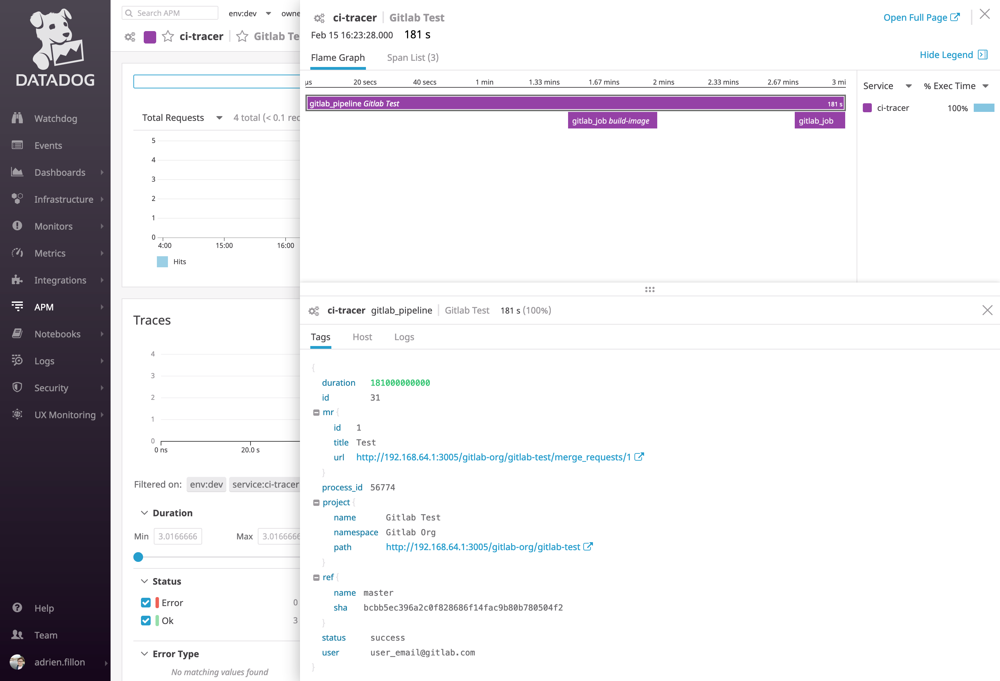
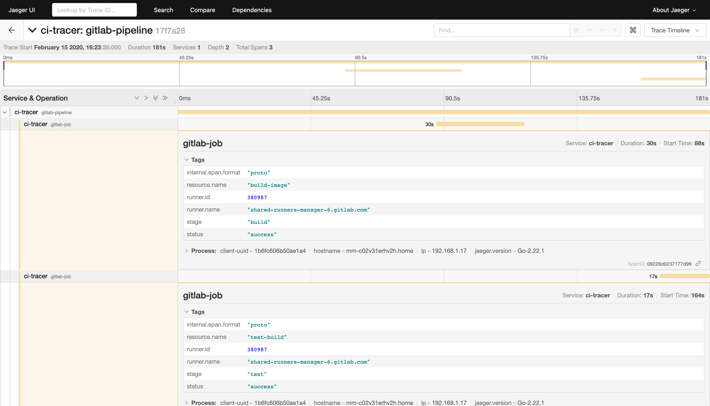

# CI Tracer

Small program to ingest webhooks from CI systems to generate Opentracing compatible traces.

At this moment, only Gitlab is supported though it should be fairly easy to add extra systems.

## Gitlab





## Getting started

```
go get -u github.com/adrien-f/ci-tracer
```

## TODO:

- [ ] Flexible Tracer configuration
- [ ] Tests (of course :p)
- [ ] Metrics


